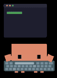

<!-- <h1 align="center">hey  i'm anh tuan</h1> -->
<h1 align="center">Hey  I'm Anh Tuan</h1>

<h3 align="center">I am an Artificial Intelligence Engineer from Vietnam</h3>

  

## 📌 About Me
- 🔭 Building AI applications with OCR, RAG, and LLM systems.
- 🧠 Interested in NLP, Multimodal AI, and AI Agents.

## 📊 GitHub Stats

  
  

## 🛠️ Languages & Tools

<h3 align="center">Programming Languages</h3>

  

<h3 align="center">Database</h3>

  &nbsp;&nbsp;
  

<h3 align="center">DevOps & Cloud</h3>

  &nbsp;&nbsp;
  

<h3 align="center">Tools</h3>

  &nbsp;&nbsp;
  

  

## 🔗 Connect with Me

  &nbsp;&nbsp;
  

## 💬 Quote
> Non-stop curious.

<picture>
  <source media="(prefers-color-scheme: dark)" srcset="https://raw.githubusercontent.com/tobiasmeyhoefer/tobiasmeyhoefer/output/github-snake-dark.svg" />
  <source media="(prefers-color-scheme: light)" srcset="https://raw.githubusercontent.com/tobiasmeyhoefer/tobiasmeyhoefer/output/github-snake.svg" />
  
</picture>

